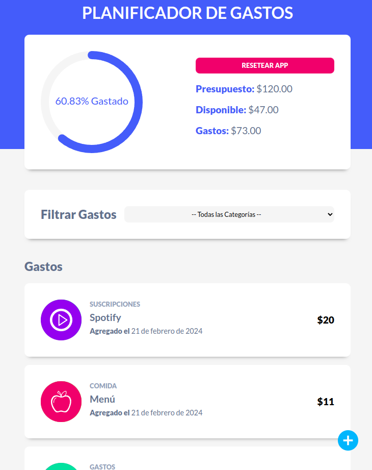

<div align="center">
  <h2>Gestor de Gastos</h2>
  <p>
    Aplicación sencilla sin Redux ni DDBB ni Backend: solo Frontend
  </p>
  </img>
</div>

## 📜 Descripción

- Se utilizó **React** y **useState** para simular las transiciones sin manejar rutas
- Las librerías adicionales **react-circular-progressbar** y **react-swipeable-list** se personalizaron para la lograr la barra circular y el efecto swipe respectivamente
- Por su practicidad, **Vite** fue elegido para inicializar, minificar y crear el *bundle* de producción
- Con el fin de persistir la data, se implementó **LocalStorage**
- El proyecto se desplegado en [**Netlify**](https://soft-manatee-e9a4f6.netlify.app/) . Además, se dockerizó el código final para pruebas locales


## 🚀 Empezar

### **Versión Online**

Usa este [enlace](https://soft-manatee-e9a4f6.netlify.app/ "Probar Demo") para probar el código desplegado en Netlify.


### **Versión Local**
1. Ejecuta los siguientes comandos para *Linux*. Previamente debes haber instalado [**Docker**](https://docs.docker.com/engine/install/) y su [**post-installation**](https://docs.docker.com/engine/install/linux-postinstall/)

```bash
# Descarga la última imagen del DockerHub:
docker pull deglanrivas/frontend-react-p2:latest

# Crea un contenedor basado en esa imagen:
docker run --rm -d -p 8080:80 --name demo_container deglanrivas/frontend-react-p2:latest

```

2. Abre [**http://localhost:8080**](http://localhost:8080/) en tu navegador para ver el resultado 🚀

3. Una vez terminada la prueba. Elimina la imagen y el contenedor
```bash
# Detén los contenedores:
docker stop demo_container && docker rmi deglanrivas/frontend-react-p2:latest

# Valida que se hayan borrado correctamente:
docker images
docker ps -a
```